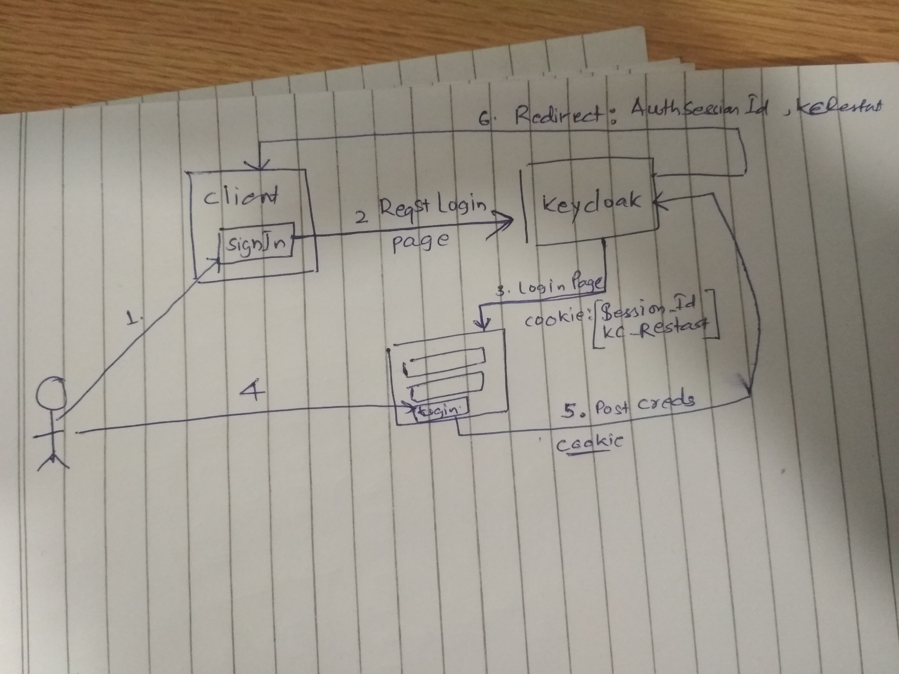
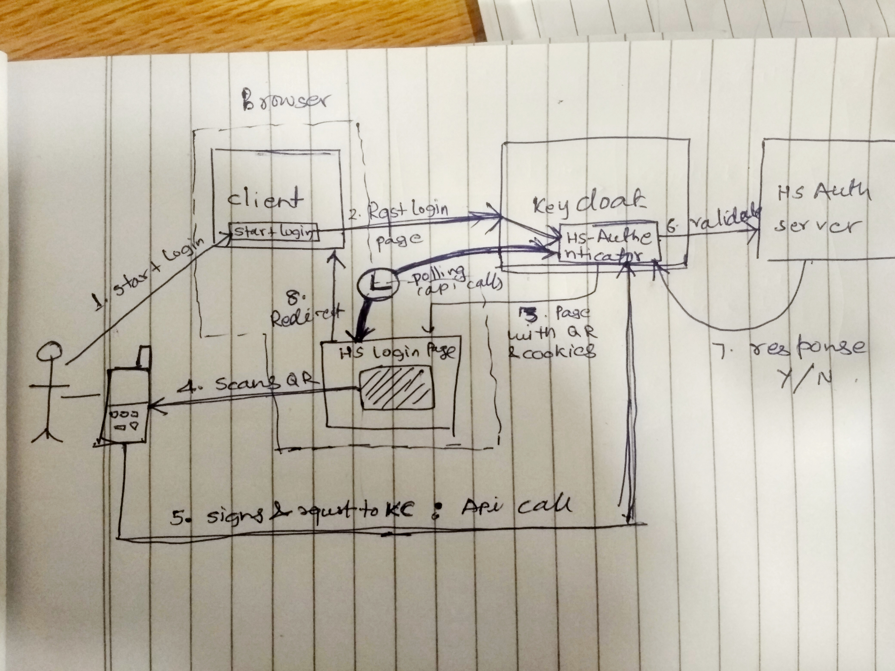

# hs-authenticator
Hypersign authenticator for Keycloak

## Setup and Installation

### Pre-requisite

**Setup maven on Linux**


```
sudo apt update
sudo apt install maven
mvn -version

```

**Setup [keycloak](https://github.com/keycloak/keycloak)**

using code

```
## clone
git clone https://github.com/keycloak/keycloak
cd keycloak

## build and install
mvn -Pdistribution -pl distribution/server-dist -am -Dmaven.test.skip clean install

## untar
tar xfz distribution/server-dist/target/keycloak-<VERSION>.tar.gz 

## run server
cd keycloak-<VERSION>
bin/standalone.sh
```

OR using docker

```
./install.sh
```

This will pull and run keycloak docker from keycloack repo. 

*Note*: 

- In case you get any error, re-run the command once again.
- The keycloack server should run on http://localhost:8080

## Setup `hs-autenticator` project on Eclipse

1. Open Eclipse IDE and select *Import exisiting maven project*
2. Browse the folder where hs-authenticator is already downloaded and import it to your eclipse worksapce.


## Build and run hs-authenticator

Set in the `bashrc`

```
vim ~/.bashrc
## set the KCBASE vairable
export KCBASE="/home/vishswasb/work/proj/hm/keycloak/keycloak-8.0.0-SNAPSHOT"
source ~/.bashrc

./clean-build-install.sh
```
or run directly

```
KCBASE="/home/vishswasb/work/proj/hm/keycloak/keycloak-8.0.0-SNAPSHOT" ./clean-build-install.sh

```

## Configuring HS authn in Keycloack

- Login to admin console.  Hit browser refresh if you are already logged in so that the new providers show up.
- Go to the Authentication menu item and go to the Flow tab, you will be able to view the currently
   defined flows.  You cannot modify an built in flows, so, to add the Authenticator you
   have to copy an existing flow or create your own.  Copy the "Browser" flow.
- In your copy, click the "Actions" menu item and "Add Execution".  Pick Secret Question
- Next you have to register the required action that you created. Click on the Required Actions tab in the Authenticaiton menu.
   Click on the Register button and choose your new Required Action.
   Your new required action should now be displayed and enabled in the required actions list.


## As is highlevel keycloak flow




## Hypersign Keycloack authentication workflow




