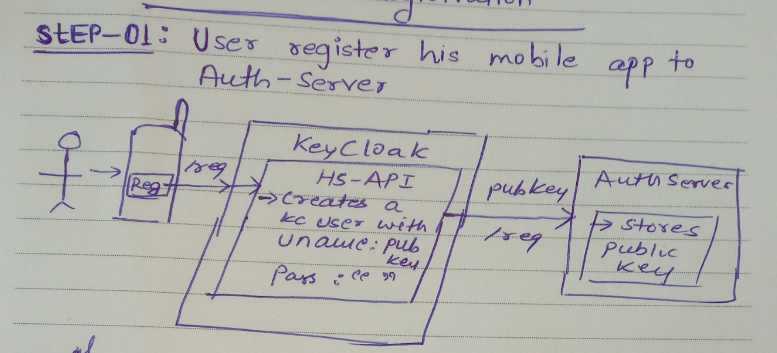
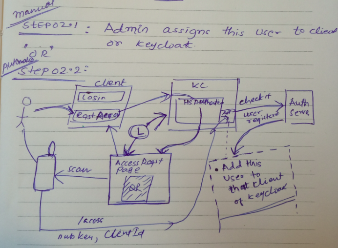

# Registration

## Mobile app registration - process

**Step01 : Register mobile app user to authserver**

- User clicks registration button on mobile app.
- `/register` api call is made to `hs-api` in keycloak with publickey and emailId
   - Creates a user with username as publickey and password as some random generated password.
   - Generate `validation-link` and send in email to the user to click.

**Step02 : User validation**

- User clicks on link in email
- `register/validate` api gets called in `hs-api` component of keycloak.
- Calls `register` api of `hs-auth-server`.

## Access request for client app - process

Two ways for it:

**Way 1 : Maual**

- Admin adds this user to the requested client app
- User can follow *Login flow* now to login.

**Way 2 : Automated**
 
- User clicks on *Register/Request Access* button on client app.
- Call goes to Keyclaock
- `hs-authenticator` produces `Access Request` page with QR (challenge, clientId, sessionId) 
   - Polling service starts to check if the request is completed from mobile app
   - It checks the status of this access requestion using the exposed api `/register/access/{clientid}/status` in `hs-api`
- User scans the QR -> signs -> make api (`/register/access/{clientid}`)  with `clientId`, `signature` and `sessionId` to `hs-api`
- `hs-api` calls `user/{publicKey}` api of `hs-auth-server` to check if this publick is already registered.
- After getting the response from `hs-auth-server`, `hs-api` update `status` for this call.
- Polling service gets the status `true` from `/register/access/{clientid}/status` ->  stops polling -> redirects user to the clientn's  home page. 

